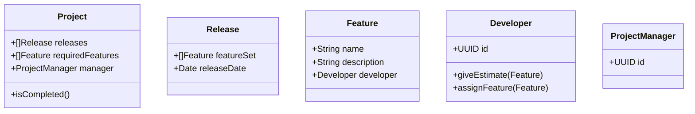

Readme is always a nice way to start a conversation going, really? I don't know, I don't even know what I am writing right now. Hope it gives you an idea...

```mermaid
classDiagram
    class Project {
        +[]Release releases
        +[]Feature requiredFeatures
        +ProjectManager manager
        +isCompleted()
    }

    class Release {
        +[]Feature featureSet
        +Date releaseDate
    }

    class Feature {
        +String name
        +String description
        +Developer developer
    }

    class Developer {
        +UUID id
        +giveEstimate(Feature)
        +assignFeature(Feature)
    }

    class ProjectManager {
        +UUID id
    }
```
