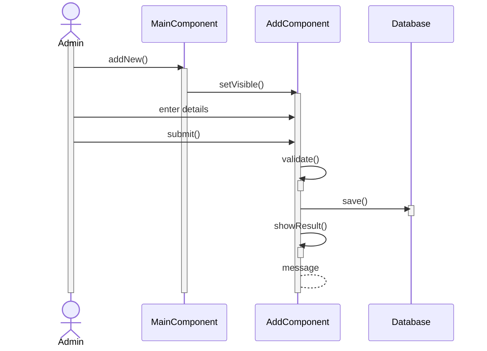

# Add a new member usecase

| User: logged in administrator | System |
| --- | --- |
| clicks add new member button | displays the form for the member detail fields |
| fills out the details | validates the details, saves them to database, shows results |

